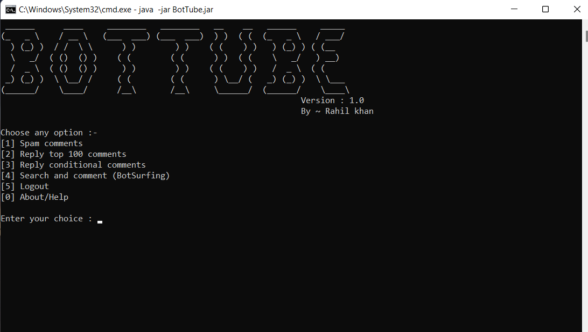

  

  
  
  
  
  

  
  
  

A Youtube bot that automates the work of commenting/replying and helps in self-promotion

<h3>
Disclaimer
</h3>

This Bot is made for **legal purposes only**. If you are tired of commenting on videos or replying to others, then it's for you. If you came here intending to spam then **YOU ARE HOLDING THE RESPONSIBILITIES OF YOUR ACCOUNT**.

<b>This Tool is made for educational purposes only</b>. Do not attempt to violate the law with anything contained here. <b>If this is your intention, then Get the hell out of here</b>!

# Features

- Auto comments
- Auto replies
- Spam comments
- Auto self-promotion
- More coming soon...

# Installation

This Bot is made in JAVA hence it is platform-independent. It can run on any platform where java (>16) is installed. However, for windows, there is a standalone **exe**. For other platforms and those who have java pre-installed on their system can download the **jar** file.

  
  

# Screenshot

This is the initial version of the BOT. More features will be added in *the future*...

# Usage

## Login / Authorizing youtube

The usage of the bot is very simple, just enter the desired input like 'comment/reply/query' and youtube video link. However, the login part is tricky. You have to authenticate your youtube account with your google cloud project. As this BOT uses **Youtube API**, you manually have to configure your own **google cloud account** to use this BOT.

### Lets sumarize the login flow :-

1. Create a [Google cloud project](https://console.cloud.google.com/apis/library/youtube.googleapis.com) with Youtube API enabled
2. Create an "**Oauth2**" credentials of type "**Web application**". Add *http://127.0.0.1* as an authorized redirect URL (Other fields of your choice)
3. Configure "**OAuth consent screen**", make publishing status to "Testing" & user type to "External". In the Test users section, add the google account (Youtube channel) on which you want to use this BOT.
4. On your **Credential page**, click on the credential you have just created (Alternatively, click the download button).
5. Finally, copy the ***client ID & secret*** and paste it into the BOT login process.

Alternatively, you can follow this [guide](https://theonetechnologies.com/blog/post/how-to-get-google-app-client-id-and-client-secret) or can see a [video tutorial](https://youtube.com) on the the the this process. **Don't forget to enable to add the fields as described in steps 2nd and 3rd.**

## Commenting / Replying

**To spam comment on a video,** select 1st option and enter the video link on which you have to comment, then the text you want to comment. **Replying** is also the same.

## Replying to conditional comments

Replying to conditional comments means that you want to reply only to the comments which meet your condition. For example, I will use this option if I want to reply to the comments which start from "Yes" or contains "Bot" (It is case-sensitive)

1. Select the 3rd option and enter the video link and comment.
2. Choose the condition for which you want to comment
3. Enter the word you want to check in the condition (Example, "Yes" or "Bot")

after that, your bot will start replying to all the comments which satisfy the condition.

## BotSurfing

BotSurfing means that a bot surfs youtube on your behalf. It will comment on the videos that match your **search query** automatically. You can use this for self-marketing or promoting your video.

1. Select the  4th option from the menu.
2. Enter the keywords or query (Which you enter in the search bar of youtube). The bot will comment on the 10 videos matching your keywords. Videos on which the bot will comment will be sorted in chronological order of upload date. You can enter multiple keywords each seperated by a comma.
3. Enter the text you want to comment on each video.

## Failures

The bot will return to the main menu every time it completes a task.

If the bot gets failed to perform a task, it will show the error immediately. If the error occurred because your quota is reached, it will log the error and then exits itself. If you have started the bot by double-clicking the **exe or jar**, you might not see the error because the terminal exits along with the program. You can avoid this behavior by manual execution of the exe or jar from the command line.

# Contribution

Contributions are always welcomed! Please first make an issue regarding any code change or modification. 

There's a lot of improvement needed in this BOT.  It also lacks many features. What you can do is you can add more features to it from the [EasyYoutube](https://github.com/ErrorxCode/EasyYoutube) library.

# That's sit

You have learned to use this bot. Now you can sit and relax while your bot does it for you. Having said that, **Don't forget the disclaimer**.

If you liked my hard work, you can give this bot a star or can follow me for more such bots. Like [BotGram](https://github.com/ErrorxCode/BotGram)
